<p align="center">
  <a href="https://raphaelmouallem.github.io"><picture><source media="(prefers-color-scheme: dark)" srcset="assets/banner-dark.svg"><source media="(prefers-color-scheme: light)" srcset="assets/banner-light.svg"></picture></a>
</p>

<p align="center">
  <a href="https://raphaelmouallem.github.io"><code>PORTFOLIO</code></a> ·
  <a href="https://raphaelmouallem.github.io/projects"><code>PROJECTS</code></a> ·
  <a href="https://raphaelmouallem.github.io/blog"><code>BLOG</code></a> ·
  <a href="https://www.linkedin.com/in/raphael-el-mouallem-1qw/"><code>LINKEDIN</code></a>
</p>

### `FIG_001 / ABOUT`

Software engineer based in Lebanon. Bachelor's and Master's 1 in Computer Science, Master's 2 in Web Development, all at the Lebanese University. I build across the whole stack, from React frontends and Spring Boot or ASP.NET backends to PyTorch models trained from scratch, and I'm most interested in projects where systems work meets AI.

Open to remote and on-site opportunities.

---

### `FIG_002 / FLAGSHIP`

<a href="https://raphaelmouallem.github.io/projects"><picture><source media="(prefers-color-scheme: dark)" srcset="assets/nexus-dark.svg"><source media="(prefers-color-scheme: light)" srcset="assets/nexus-light.svg"></picture></a>

**Nexus** is an enterprise RAG platform I designed and built solo during a five-month internship at Everteam Intalio, for Alfa, a Lebanese mobile operator. It was also the subject of my Master's thesis.

- ASP.NET orchestrator (Clean Architecture, CQRS via MediatR) with stateless Python microservices for AI, TTS, STT, translation and fine-tuning
- Ingestion for text, DOCX, PDF, scans (OCR), audio (Whisper) and images, with three chunking strategies (sliding window, hierarchical, RAPTOR)
- Hybrid dense + lexical retrieval fused with RRF, filtered by department before any content reaches the model; cited answers streamed over SSE
- One Angular codebase shipped as web, Capacitor mobile and Tauri desktop apps
- Sandboxed code execution, 7 security scanners in CI, OpenTelemetry tracing into Grafana
- In my evaluation (a small 10-document corpus), RAPTOR with hybrid retrieval reached 94.2% recall@5

---

### `FIG_003 / BUILT FROM SCRATCH`

<a href="https://github.com/RaphaelMouallem/gpt2-mini"><picture><source media="(prefers-color-scheme: dark)" srcset="assets/gpt2-dark.svg"><source media="(prefers-color-scheme: light)" srcset="assets/gpt2-light.svg"></picture></a>

A 151M-parameter decoder-only transformer, written without a model library: RoPE via complex rotations, SwiGLU feed-forward blocks, weight tying and pre-norm. It was pre-trained on Wikipedia, then fine-tuned on user/bot dialogue with masked labels so the loss only flows through bot turns. Training ran on Apple Silicon (MPS) and Colab, with bfloat16, gradient accumulation and an incremental 6 → 8 → 12 head strategy to fit in RAM. [Source and write-up →](https://github.com/RaphaelMouallem/gpt2-mini)

---

<picture><source media="(prefers-color-scheme: dark)" srcset="assets/stack-dark.svg"><source media="(prefers-color-scheme: light)" srcset="assets/stack-light.svg"></picture>

---

### `FIG_005 / MORE WORK`

| Project | What it is | |
|---|---|---|
| **2D Shape Nesting** | BSc final year project: three Python modules for nesting regular and irregular 2D shapes, with polygon detection from images via OpenCV | [Cutting-Board](https://github.com/RaphaelMouallem/Cutting-Board) · [nesting2d](https://github.com/RaphaelMouallem/nesting2d) |
| **Fitness App** | Cross-platform Flutter app: multi-user, TTS workout guidance, local database, data export | |
| **Finance Tracker** | Angular app on a Django backend and PostgreSQL: budgeting, categorization, statistics, .xlsx import | |
| **E-Commerce** | React + TailwindCSS storefront on Spring Boot, PostgreSQL and Flyway, with authentication | |
| **This portfolio** | Japandi-style site: paper textures, procedural SVG, Framer Motion | [source](https://github.com/RaphaelMouallem/raphaelmouallem.github.io) |

### `FIG_006 / PATH`

| | |
|---|---|
| **2026** | Internship at Everteam Intalio (Feb to Jul): built Nexus. Master's thesis on it defended Sept 9 |
| **2025** | FinTech intern, SoftManagement: POS systems, card transaction lifecycles, ISO 8583 |
| **2025 to 2026** | Master's 2, Web Development, Lebanese University |
| **2024 to 2025** | Master's 1, Computer Science |
| **2021 to 2024** | Bachelor's, Computer Science |

Languages: Arabic (native), English (fluent), French (proficient).

---

```
raphaelm ~ % contact --init
```
[LinkedIn](https://www.linkedin.com/in/raphael-el-mouallem-1qw/) · [Portfolio](https://raphaelmouallem.github.io)
